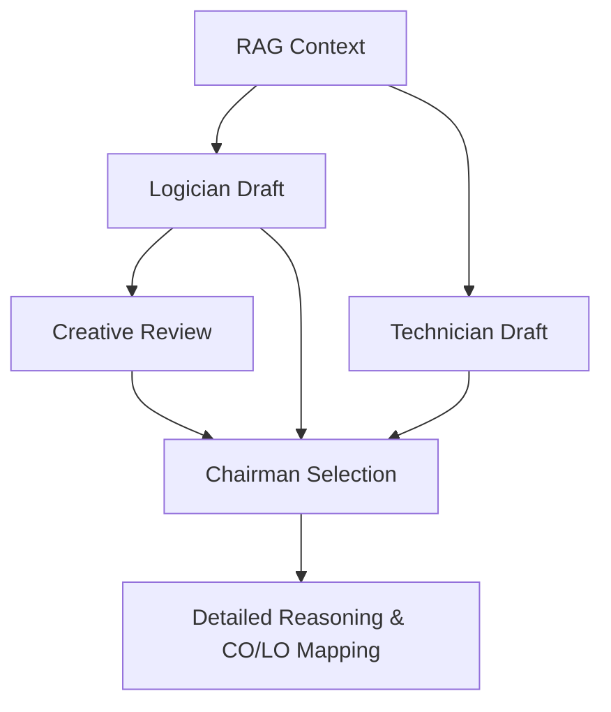

# Project Overview: AI-Powered Council LMS 🚀

This document provides a high-level technical explanation of the most critical systems in your AI-Powered Outcome-Based Education (OBE) Learning Management System.

---

## 1. RAG (Retrieval-Augmented Generation)
**The Problem**: Generic LLMs hallucinate or provide outdated information.
**The Solution**: We "ground" the AI in your specific study materials (Textbooks, Notes, Syllabus).

### How it works:
1.  **Ingestion**: When you upload a PDF or Docx, it is stripped of text and split into "chunks" (500 characters each).
2.  **Vector Storage**: These chunks are stored in **ChromaDB** as high-dimensional vectors (mathematical representations of meaning).
3.  **Hybrid Scope Retrieval**: 
    - The system doesn't just search everything. It uses **Metadata Scoping** (Unit ID, Topic ID).
    - If you are generating a question for Unit 2, it first tries to find chunks only from Unit 2.
    - **Fallback**: If Unit 2 is empty, it expands the search to the whole Subject.
4.  **De-duplication**: It ensures the same topic doesn't repeat by hashing chunks used in the current session.

---

## 2. The Council (Multi-Agent Swarm)
**The Problem**: Single-shot LLM responses often lack depth, pedagogical structure, or factual grounding.
**The Solution**: We use a **Council of 4 specialized AI Agents** that deliberate over every single question.

### The Agent Swarm:
| Agent | Role | Model (Ollama) |
| :--- | :--- | :--- |
| **Logician** | Generates the first draft strictly from study material. | `phi3.5` |
| **Creative** | Critiques the draft (accuracy, clarity, difficulty). | `gemma2:2b` |
| **Technician** | Generates an alternative draft with precise formatting. | `qwen2.5:3b` |
| **Chairman** | The final arbiter. Compares all drafts and selects the best. | `phi3.5` |

### The Deliberation Process:

---

## 3. SkillUp (Dynamic Training Pipeline)
**The Problem**: Default AI models don't know your specific university standards or faculty preferences.
**The Solution**: The system "learns" from your approvals and rejections.

### The Pipeline:
1.  **Data Collection**: Once you vet **5+ questions**, the system has a "training set".
2.  **Skill Synthesis**: It analyzes which questions you approved vs. rejected (and why). It generates a `SKILL.md`—a set of secret instructions injected into the AI's "brain" for future generations.
3.  **A/B Testing (Evaluation)**:
    - **Baseline**: Runs test cases with the raw model.
    - **Trained**: Runs same cases with the new "Skill" instructions.
4.  **Auto-Activation**: The skill only goes live if the **Trained** score is better than the **Baseline**. This prevents the AI from "getting worse" (regression).

---

## 4. OBE (Outcome-Based Education) Integration
The system is built around academic accountability:
- **Course Outcomes (COs)**: High-level goals (e.g., "Analyze system performance").
- **Learning Outcomes (LOs)**: Unit-level targets.
- **Bloom's Taxonomy**: Automatically ensures verbs match the difficulty level (e.g., "List" for Easy/K1, "Evaluate" for Hard/K5).

---

## 5. Local Infrastructure (Ollama)
- **Privacy**: No data leaves the machine. Everything runs locally on the GPU.
- **Portability**: Uses standard Ollama models, making it easy to swap or upgrade models as better ones release.
